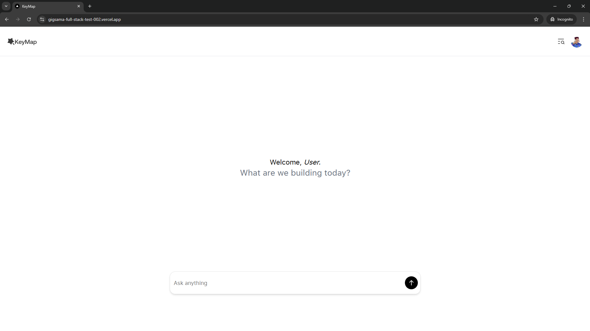
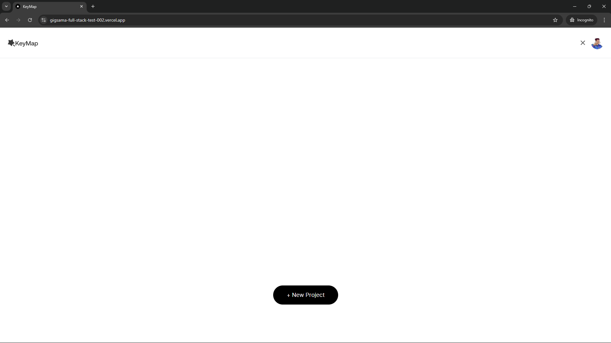
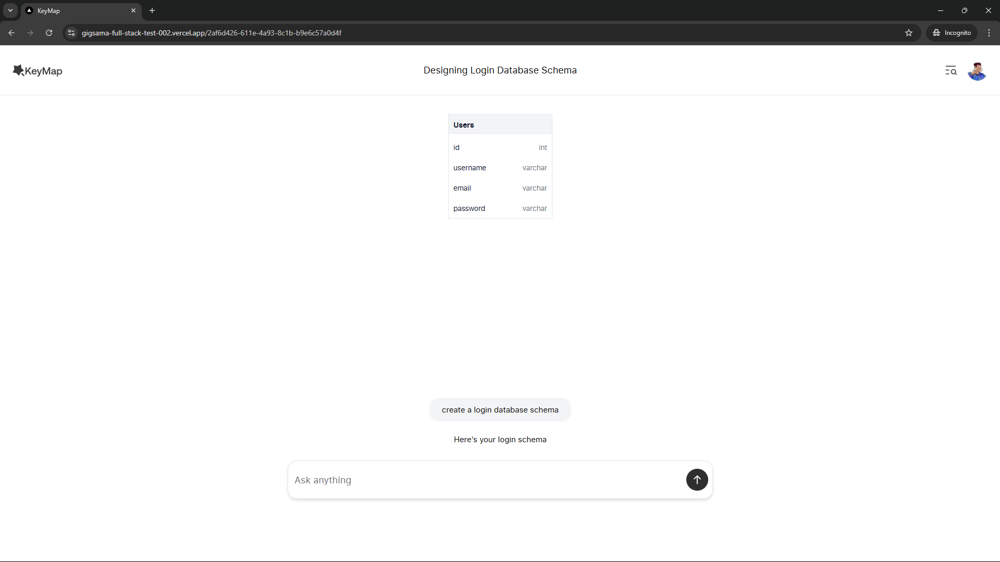
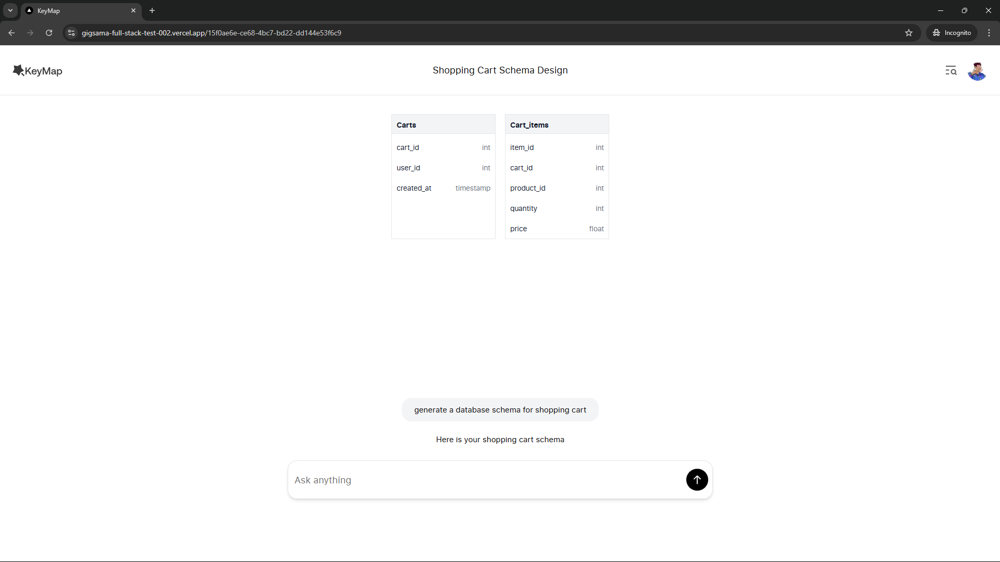
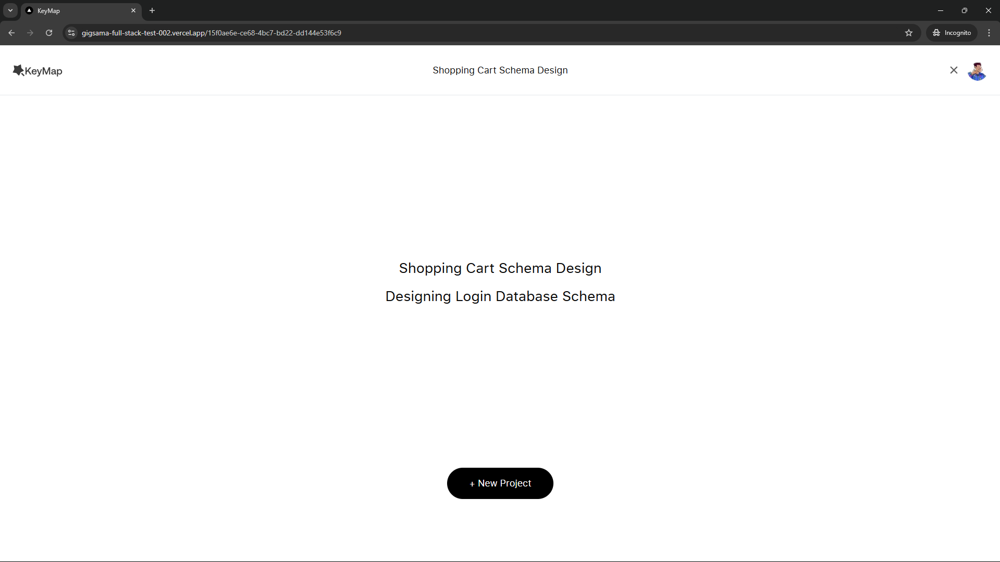

# Gigsama-FullStack-Test-002

## Chat-Based AI with Schema Generation

## Overview
This project is a chat-based AI application built using Node.js, Express, and SQLite. It integrates an LLM (GPT-4o) to generate responses and dynamically suggest database schemas based on user queries. The system stores conversation history and associated schemas for reference.

## Technology Choices
- **Node.js & Express**: Chosen for backend API development due to its performance and scalability.
- **SQLite (Better-SQLite3)**: Selected for lightweight, file-based storage of chat history and schema data.
- **OpenAI GPT-4o**: Used for generating AI-driven responses and schema recommendations.
- **Axios**: Handles API requests.

## Key Features
1. **AI Chat Integration**: Users can send messages, and the system provides AI-generated responses.
2. **Schema Generation**: The AI suggests database schemas when relevant to the conversation.
3. **Conversation History**: Each chat session is stored in an SQLite database for reference.
4. **Project Management**: Chats are grouped under projects, allowing users to continue previous discussions.

## Implementation Details
### AI Integration
- User messages are sent to the LLM via OpenAI's API.
- The system formats a prompt with prior conversation history.
- The AI returns a structured JSON response containing:
  - `response`: A concise text reply.
  - `schema`: A suggested database schema or `null` if not applicable.

### Schema Handling
- The AI is instructed to generate schemas in SQL format.
- The schemas are stored in SQLite as JSON for later retrieval.
- A utility function normalizes schema data before saving.

### Storage Mechanism
- **Projects Table**: Stores chat sessions.
- **Responses Table**: Saves user messages, AI responses, and schema data.
- **SQLite (Better-SQLite3)** provides fast and efficient database operations.

## Setup and Installation
### Prerequisites
- Node.js (>=16.x)
- NPM or Yarn

### Installation Steps
1. Clone the repository:
   ```sh
   git clone <repository-url>
   cd <project-folder>
   ```
2. Install dependencies:
   ```sh
   npm install
   ```
3. Set up environment variables .env and .env.local in the /backend and /frontend directories respectively:
   - Create a `.env` file in `/backend` directory and define:
     ```.env
     LLM_API_KEY=your_openai_api_key
     LLM_MODEL=gpt-4o
     ```

    - Create a `.env.local` file in `/frontend` directory and define it as:
     ```.env.local
     NEXT_PUBLIC_API_URL=your_backend_api_url (e.g http://localhost:5000)
     ```
4. In the project's root directory, start the server:
   ```sh
   npm start
   ```

## API Endpoints
### 1. Get All Projects
**GET** `/api/projects`
- Returns a list of all chat projects.

### 2. Start a Chat or Continue a Project
**POST** `/api/chat`
- **Request Body:**
  ```json
  {
    "message": "Your message here",
    "projectId": "existing_project_id (optional)"
  }
  ```
- **Response:**
  ```json
  {
    "response": "AI-generated reply",
    "schema": {"table_name": {"field_name": "sql_data_type"}},
    "projectId": "chat_project_id",
    "projectName": "Project Name"
  }
  ```

### 3. Retrieve Chat History
**GET** `/api/projects/:projectId/history`
- Returns the conversation history for a given project.

## Demo & Live Version
- If available, provide a link to the live demo: `[https://gigsama-full-stack-test-002.vercel.app/]`

- Screenshots or sample API requests can be included.







## Future Enhancements
- Implement user authentication for personalized chat sessions.
- Support additional LLM providers.
- Enhance schema validation and export features.

## Contributors
- Obed Gyamfi (@obedgyamfi)

